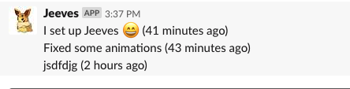

# jeeves

Jeeves is the robot to help me remember what I've spent in my 40-ish hours of work over the previous week!

Tell him what you did:

<h3 align="center">
  
</h3>

And he'll remind you the following week when you get around to writing your status update:


<h3 align="center">
  
</h3>

## Running it

For now, you pretty much can't run him locally; sorry.

## Deploying it

Make sure you have chalice installed, and then:

```
$ ./deploy.sh
```